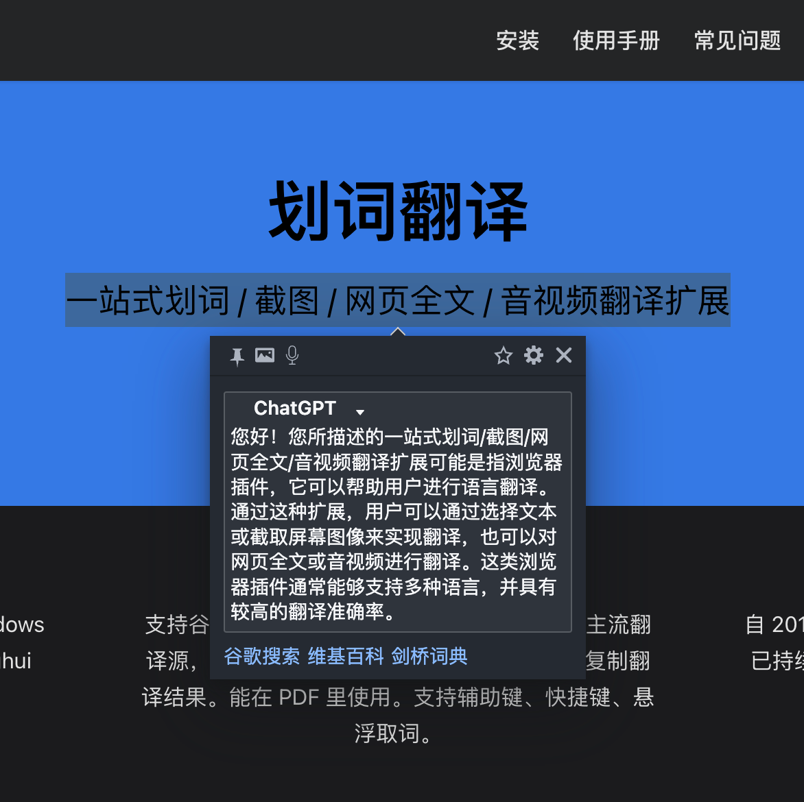

# @hcfy/plugin-chatgpt

在划词翻译中使用 ChatGPT。

## 如何使用

你需要确保你已经注册过 ChatGPT 并能在网页上正常对话，然后：

1. 前往 [https://chat.openai.com/chat](https://chat.openai.com/chat)，找到名为 `__Secure-next-auth.session-token` 的 Cookie 并将值写入环境变量 `SESSION_TOKEN` 中。详细步骤请查看：https://github.com/transitive-bullshit/chatgpt-api#session-tokens
2. 安装 Node.js。
3. 运行 `npm i -g @hcfy/plugin-chatgpt`，然后运行 `hcfy-chatgpt`。
4. 前往划词翻译的【设置】-【通用】-【自定义翻译源】，将“接口地址”填写 `http://localhost:8888`，将“翻译源名称”填写 `ChatGPT`，然后点击【测试】按钮。

如果能正常弹出结果，那么就可以在网页上划词并显示 ChatGPT 的回复了，如下图：

